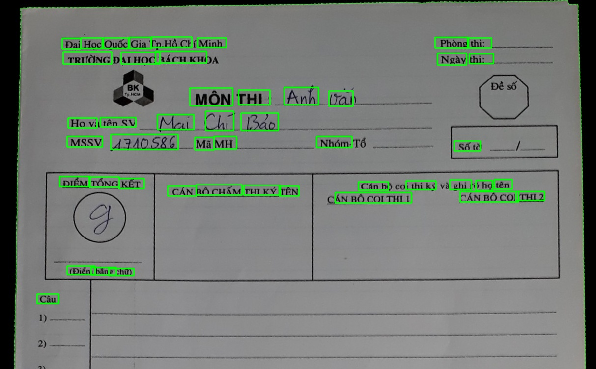

# Information-recognition-on-the-university-test-paper
## Table of contents
* [1. Introduction](#1-Introduction)
* [2. Dataset](#2-Dataset)
* [3. Image preprocessing](#3-Image-preprocessing)
* [4. Word segmentation](#4-Word-segmentation)
* [5. Model](#5-Model)
* [6. Training](#6-K-fold-cross-validation)
* [7. Result](#7-Result)

## 1. Introduction
This project is a part of my thesis. In short, you guys may or may not know that our teachers spend too much time on updating scores. Around 4000 test papers/a year on average for a secondary school teacher according to this [news](https://giaoduc.net.vn/giao-duc-24h/thong-tu-so-26-2020-tt-bgddt-da-go-bo-duoc-nhieu-ap-luc-cho-hoc-tro-va-giao-vien-post212222.gd)

The whole thesis is to help teacher update scores into Excel automatically after marking their students’ tests. But in this project we just extract information such as names, student ID, and recognize them to prepare for later stage.

<i>Hình 1. Test paper of Ho Chi Minh University of Technology </i>

As you can see, I use my university's test paper. My name is Mai Chi Bao and my student ID (MSSV) is 1710586. Those are handwritten information and I wanna cut them out. Of course the score too. But we will dicuss about it later at other repository.

## 2. Dataset
* Word dataset for name: [ICFHR2018 Competition on Vietnamese Online Handwritten Text Recognition Database (HANDS-VNOnDB2018)](http://tc11.cvc.uab.es/datasets/HANDS-VNOnDB2018_1/) . You can use `data/inkml_2_img.py` to covert ikml file into images
* Digit dataset for student ID and score: MNIST dataset. I generated multi - digit number from MNIST. You can find the code in my [repo](https://github.com/mrzaizai2k/Multi-digit-images-generator-MNIST-)

Those are raw data, of course they won't help at all without Data Augmentation
* Elastic Transform
* Adding blob, line noise
* Random Cutout
* Rotate and Scale

I applied them all in `source/prepare_MSSV_dataset.py` and `source/imgtocsv.py` for both name and student ID training. I found that those methods are not enough, so the solution is to collect more real data. I did add about 220 images for each, with Data augmentation I can make it to 20000 images and the result was good

## 3. Image Preprocessing
You can find code in `source/Preprocessing.py` 
The flow of this stage is:
1. Image Alignment 
2. Maximize Contrast
3. Otsu Threshold
4. Remove line/circle

When we first take the input image, we take the background information too, and the picture is not in the right direction which is hard to extract and recognize. With the help of Image Alignment, the work is much easier. 

<i>Hình 2. Image Alignment </i>

Reference: https://www.pyimagesearch.com/2020/08/31/image-alignment-and-registration-with-opencv/

Then I crop images I need with fixed pixels at all times

<i>Hình 3. MSSV_crop.jpg </i>

I used contrast maximization with [Top hat and Black hat method](https://www.quora.com/Why-use-the-top-hat-and-black-hat-morphological-operations-in-image-processing). I found this can hold back lots of necessary information after Otsu Threshold, especially with blur images. 

I did compare between Adaptive Threshold and Otsu Theshold. Adaptive Threshold which we know that works really well with variations in lighting conditions, shadowing... You can visit this [site](https://www.pyimagesearch.com/2021/05/12/adaptive-thresholding-with-opencv-cv2-adaptivethreshold/) to know more. But it also retains noise. It's like **a lot of noise** which is hard to remove line and recognize even having Gaussian Blur step before. Otsu turns out performing so well, I guess that because the small size of image after cropping reduces the effect of light variance.   

<i>Hình 4. Image after removing line </i>

## 4. Word segmentation
I have compared between EAST and Scale Space techniques. You can see the result of EAST

<i>Hình 5. EAST result </i>

Pretty good hah! But these drawbacks made me decide to choose Scale Space technique:
* Both width and height must be pre-resized to be multiples of 32 
* Working good on the whole test paper but bad on the small images that we have cropped
* High latency compared to the whole project combined (about 2s and 1s) due to it's complexity. And it's not necessary for my case

Scale Space technique:
* Blurring
* Otsu Threshold 
* Drawing Contour
Those steps could be easily applied with OpenCV, and with a few more steps I can extract the position of words and then seperate them to recognize. OLD BUT GOOD

<i>Hình 6. Word segmentation </i>

Reference: https://www.researchgate.net/publication/2375892_Scale_Space_Technique_for_Word_Segmentation_in_Handwritten_Manuscripts

## 5. Model
My model here is CRNN + Attention + CTC Loss

I will briefly describe the model. You can easily find papers about this model cause it's too famous
* CNN: Image feature extraction
* Attention: Retain important information 
* RNN: Sequential data (here I use Bi-LSTM)
* CTC loss: Reducing the cost for labeling data

I also used Batch Normalization, Drop out,... The model structure is in `source/word_model.py`. Both name and studen ID Recognition share the same model

Reference:
* CRNN + CTC loss: https://arxiv.org/abs/1507.05717
* CTC loss: https://distill.pub/2017/ctc/
* Attention: http://www.wildml.com/2016/01/attention-and-memory-in-deep-learning-and-nlp/

## 6. Training
I have created 2 Kaggle Notebooks for training name and student ID (MSSV). I had carefully explained stages there so I won't try writing all of them again here.
* [Name training](https://www.kaggle.com/bomaich/vietnamese-handwritten-ocr-word-dataset)
* [MSSV training](https://www.kaggle.com/bomaich/multi-digit-crnn-ctc)

I also used Early Stopping, Learning rate changing to increase the performance

You can find the `.h5` model in my [google drive](https://drive.google.com/drive/folders/1z2GdAg8uz-ZCni1glbG1A-M6f7-R_6Y2?usp=sharing) because GitHub don't allow me to upload file bigger than 25Mb

## 7. Result

The differences in word and number dataset lead to a cascade of differences in the way I trained model, set up parameters and evaluated. Here for the name recognition I will evaluate mainly on methods that I used in training phase. Due to the lack of real data, I would evaluate number recognition on the way I created dataset

The fisrt 2 tables are the evalution of 122 test papers of just my name and MSSV (with a wide range of light, camera angle and distance, picture resolution...) And use them to find my index in my class list of 245 students 

**Name Recognition**
|      | CRNN + CTC | + Data Augmentation | + Learning Rate changing | + Attention | + Lexicon search |
| -----|:---: |:---:|:---: |:---:|:---:|
| CER | 35.25%	| 23.40% |	16.77% |	16.24% |	0.45% |
| WER | 74.59%	| 69.40%	| 45.63%	| 47.27%	| 0.55% |

**MSSV Recognition**
|      | 7-digit number and blob noise | + Combination of 1,3,4,5,7-digit number | + Rotate, scale,  Random Cutout, Line Noise on digit images | + Changing the distance between digits. Scale, Rotate on multi-digit images| + Adding real data |+ Lexicon search |
| -----|:---: |:---:|:---: |:---:|:---:|:---:|
| CER | 63.82%	| 48.24%	| 45.55%	| 13.58%	| 3.63%	| 2.58%|
| WER | 100.00%	 | 100.00%	| 100.00% |	63.11%	| 22.95%	| 6.56%|

I have 70 test papers of other students written by 5 people (mostly by my family and friends due to Covid - 19). The accuracy is **97.14%** (just 2 out of 70 are uncorrect)

Conclusion:
* Add more real data to improve the outcome
* The combination of CRNN - CTC, Attention, Lexicon Search
* If you want to train your model faster, you should add Batch Normalization and Use Early stopping
* Changing Learning Rate help. But just in it's first time. The more you use it, the easier your model get overfit. And it slows down the training phase for nothing
* Choosing the right Data Augmentation methods can boost the result up to 50%. Working on simulated data is fine, but if you want to use it in real life, you would need real dataset size is small
* Don't use Drop out before RNN layer b/c it won't help. I guess it takes all the data RNN need away.

