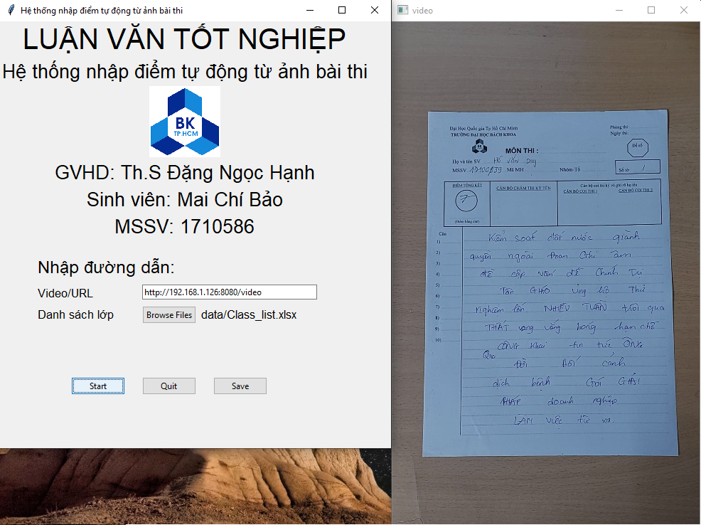
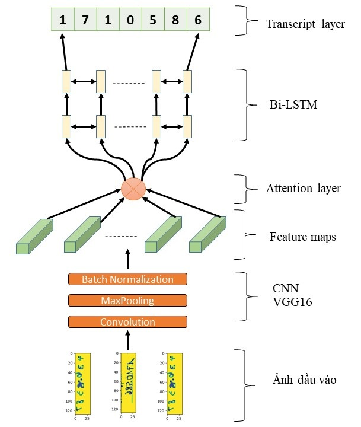

# Automated-scoring-of-handwritten-test-papers
**For Vietnamese student, you can read the `LVTN_Mai Chí Bảo_1710586.pdf` and `LVTN_Mai Chí Bảo_1710586.pptx` which is written in Vietnamese. For foreign reader, I'll update the English version ASAP**
* Hệ thống nhập điểm tự động từ ảnh bài thi - Demo on Youtube: https://youtu.be/EUY0zR642f0
* Automatic Scoring of Handwritten test papers (Youtube - link full): https://youtu.be/fqVMa03iPVE

## Table of contents
* [1. Introduction](#1-Introduction)
* [2. User](#2-User)
* [3. Dataset](#3-Dataset)
* [4. Image preprocessing](#4-Image-preprocessing)
* [5. Word segmentation](#5-Word-segmentation)
* [6. Model](#6-Model)
* [7. Training](#7-Training)
* [8. Result](#8-Result)
* [9. Conclusion](#9-Conclusion)

## 1. Introduction
This project is a part of my thesis. In short, a secondary school teacher spend too much time on updating score manually (around 4000 test papers/year according to this [news](https://giaoduc.net.vn/giao-duc-24h/thong-tu-so-26-2020-tt-bgddt-da-go-bo-duoc-nhieu-ap-luc-cho-hoc-tro-va-giao-vien-post212222.gd) )

The goal of the thesis is to assist teachers in automatically updating results in Excel after marking their students' tests. However, in this project, we just collect data such as names and student IDs and recognize them in order to prepare for the next stage.

<i>Figure 1. Test paper of Ho Chi Minh University of Technology </i>

As you can see, I use my university's test paper. My name is Mai Chi Bao and my student ID (MSSV) is 1710586. Those are handwritten information that I'd want to cut out. Of course, there's the score. But we'll talk about it at another repository later.

## 2. User
The workflow of this system is like this
1. Image is continuously captured by the phone's camera which already have this App called [IP Camera](https://www.youtube.com/watch?v=POX772xjHws)
2. Computer will take Image from the Web Server of the IP Camera App to process
3. Automatically update the score into Excel like this `data/Class_list.xlsx`

The GUI: 
* 1 Text box for entering the Web Server address 
* 1 Broswer file button to choose the Class list file in our laptop
* 3 button: Start, Quit, Save
After pressing the Start button, It'll appear the Test paper Image. I'll update the youtube video when I'm using it for you guys ASAP

<i>Figure 2. GUI </i>

## 3. Dataset
* Word dataset for name: [ICFHR2018 Competition on Vietnamese Online Handwritten Text Recognition Database (HANDS-VNOnDB2018)](http://tc11.cvc.uab.es/datasets/HANDS-VNOnDB2018_1/) . You can use `data/inkml_2_img.py` to covert ikml file into images
* Digit dataset for student ID and score: MNIST dataset. I generated multi - digit number from MNIST. You can find the code in my [repo](https://github.com/mrzaizai2k/Multi-digit-images-generator-MNIST-)

Those are raw data, and without Data Augmentation, they won't assist at all.
* Elastic Transform
* Adding blob, line noise
* Random Cutout
* Rotate and Scale

I applied them all in `source/prepare_MSSV_dataset.py` and `source/imgtocsv.py` for both name and student ID training. I found that those methods are not enough, so the solution is to collect more real data. I added about 220 photos for each, and with data augmentation, I was able to increase it to 20000 images, with good results.

## 4. Image Preprocessing
You can find code in `source/Preprocessing.py` 
The flow of this stage is:
1. Image Alignment 
2. Maximize Contrast
3. Otsu Threshold
4. Remove line/circle

We take the background information with the input image, and the picture is not in the proper direction, making it difficult to extract and recognize. The process is significantly easier with the aid of Image Alignment.

<i>Figure 3. Image Alignment </i>

Reference: https://www.pyimagesearch.com/2020/08/31/image-alignment-and-registration-with-opencv/

Then I crop images I need with fixed pixels at all times

<i>Figure 4. MSSV_crop.jpg </i>

I used contrast maximization with [Top hat and Black hat method](https://www.quora.com/Why-use-the-top-hat-and-black-hat-morphological-operations-in-image-processing). I found this can hold back lots of necessary information after Otsu Threshold, especially with blur images. 

I did compare between Adaptive Threshold and Otsu Theshold. Adaptive Threshold which we know that works really well with variations in lighting conditions, shadowing... You can visit this [site](https://www.pyimagesearch.com/2021/05/12/adaptive-thresholding-with-opencv-cv2-adaptivethreshold/) to know more. However, noise is retained. Even with the Gaussian Blur step. It's like **a lot of noise** which is hard to apply remove line and recognize step successfully. Otsu turns out performing so well, I guess that because the small size of image after cropping reduces the effect of light variance.   

<i>Figure 5. Image after removing line </i>

## 5. Word segmentation
I have compared between EAST and Scale Space techniques. You can see the result of EAST

<i>Figure 6. EAST result </i>

Pretty good hah! But these drawbacks made me decide to choose Scale Space technique:
* Both width and height must be pre-resized to be multiples of 32 
* Working good on the whole test paper but bad on the small images that we have cropped
* High latency compared to the whole project combined (about 2s and 1s) due to it's complexity. And it's not necessary for my case

Scale Space technique:
* Blurring
* Otsu Threshold 
* Drawing Contour
Those steps could be easily applied with OpenCV, and with a few more steps I can extract the position of words and then seperate them to recognize. OLD BUT GOOD

<i>Figure 7. Word segmentation </i>

Reference: https://www.researchgate.net/publication/2375892_Scale_Space_Technique_for_Word_Segmentation_in_Handwritten_Manuscripts

## 6. Model
My model here is CRNN + Attention + CTC Loss

<i>Figure 8. Model Structure </i>

I will briefly describe the model. You can easily find papers about this model cause it's too famous
* CNN: Image feature extraction
* Attention: Retain important information 
* RNN: Sequential data (here I use Bi-LSTM)
* CTC loss: Reducing the cost for labeling data

I also used Batch Normalization, Drop out,... The model structure is in `source/word_model.py`. Both name and studen ID Recognition share the same model

Reference:
* CRNN + CTC loss: https://arxiv.org/abs/1507.05717
* CTC loss: https://distill.pub/2017/ctc/
* Attention: http://www.wildml.com/2016/01/attention-and-memory-in-deep-learning-and-nlp/

## 7. Training
I have created 2 Kaggle Notebooks for training name and student ID (MSSV). I had carefully explained stages there so I won't try writing all of them again here.
* [Name training notebook](https://www.kaggle.com/bomaich/vietnamese-handwritten-ocr-word-dataset)
* [MSSV training notebook](https://www.kaggle.com/bomaich/multi-digit-crnn-ctc)

I also used Early Stopping, Learning rate changing to increase the performance

You can find the `.h5` model in my [google drive](https://drive.google.com/drive/folders/1z2GdAg8uz-ZCni1glbG1A-M6f7-R_6Y2?usp=sharing) because GitHub don't allow me to upload file bigger than 25Mb

## 8. Result
Because of the variations in the word and number datasets, I had to change the way I trained the model, set up parameters, and assessed it. For name recognition, I'll focus on the strategies I employed throughout the training phase. Due to the lack of real data, I'd evaluate number recognition based on how I built the dataset.

### 8.1 Result on 122 images set
**For evaluating the impact of changes on Image processing and model structure**

The first two tables show the results of 122 test papers with only my name and MSSV on them (with a wide range of light, camera angle and distance, picture resolution...) And utilize them to identify my index in my 245-student class list.

**Name Recognition**
|      | CRNN + CTC | + Data Augmentation | + Learning Rate changing | + Attention | + Lexicon search |
| -----|:---: |:---:|:---: |:---:|:---:|
| CER | 35.25%	| 23.40% |	16.77% |	16.24% |	0.45% |
| WER | 74.59%	| 69.40%	| 45.63%	| 47.27%	| 0.55% |

<i> Table 1. Result of Name recognition on 122 images </i>

**MSSV Recognition**
|      | 7-digit number and blob noise | + Combination of 1,3,4,5,7-digit number | + Rotate, scale,  Random Cutout, Line Noise on digit images | + Changing the distance between digits. Scale, Rotate on multi-digit images| + Adding real data |+ Lexicon search |
| -----|:---: |:---:|:---: |:---:|:---:|:---:|
| CER | 63.82%	| 48.24%	| 45.55%	| 13.58%	| 3.63%	| 2.58%|
| WER | 100.00%	 | 100.00%	| 100.00% |	63.11%	| 22.95%	| 13.11%|

<i> Table 2. Result of Student ID recognition on 122 images </i>

### 8.2 Result on 100 Unconstrained Images
**For evaluating the performance of the system in bad condition**

Unconstrained:
* Background, camera angle, light
* Font Type

<i>Figure 9. Student Index Recognition on 100 Unconstrained set </i>

<i>Figure 10. Student Score Recognition on 100 Unconstrained set </i>

### 8.3 Result on 103 Constrained Images
**For evaluating the performance of the system without the error from the user**

Constrained:
* Background, camera angle, light
* Font Type

<i>Figure 11. Student Index Recognition on 103 Constrained set </i>

<i>Figure 12. Student Score Recognition on 103 Constrained set </i>

### 8.4 Result on video
Unlike recognition on each image which is quite easy to predict the right index (name & student ID) thanks to the Lexicon Search, it's really hard to increase the accuracy of score recognition up to 90%. In the real environment where the system operate, images are continuously processed like video frames. Based on that idea, the score won't be updated unless the system recognizes the same information (name, student ID, score) 3 times in a row.

**The final result of the system is 95.55% (43/45 images)**

<i>Figure 13. Flowchart diagram for video recognitiont </i>

## 9. Conclusion
* Add more real data to improve the outcome
* The combination of CRNN - CTC, Attention help increase the result of Lexicon Search. I found the without Attention layer, CER and WER is lower (cause the model predicts less characters). Model with attention can be wrong but it's enough for Lexicon to perform well 
* If you want to train your model faster, you should add Batch Normalization and Use Early stopping
* Changing Learning Rate help. But just in it's first time. The more you use it, the easier your model get overfit. And it slows down the training phase for nothing
* Choosing the right Data Augmentation methods can boost the result up to 50%. Working on simulated data is fine, but if you want to use it in real life, you would need real dataset size is small
* Don't use Drop out before RNN layer b/c it won't help. I guess it takes all the data RNN need away.

